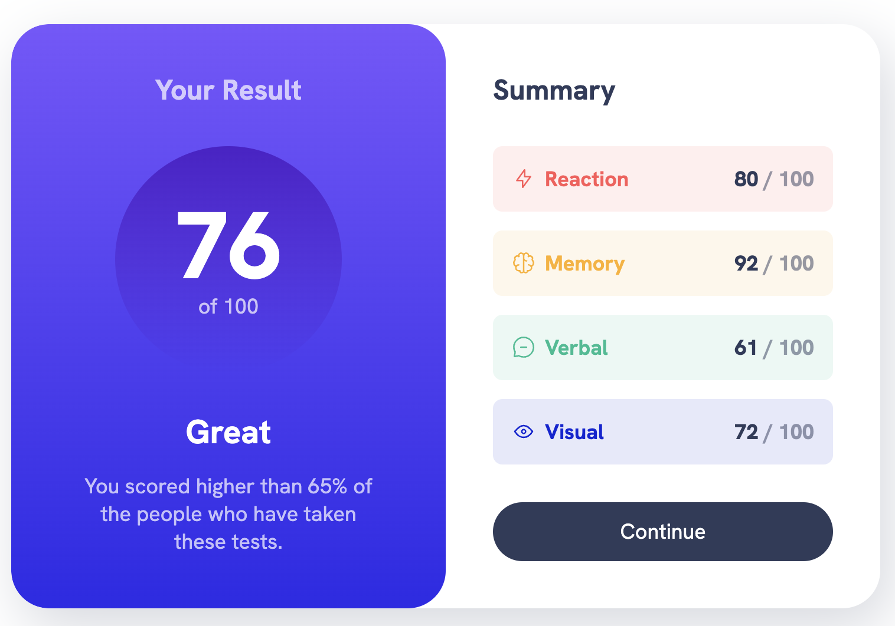

# Frontend Mentor - Results summary component

This is a solution to the [Results summary component
on Frontend Mentor](https://www.frontendmentor.io/challenges/results-summary-component-CE_K6s0maV). Frontend Mentor challenges help you improve your coding skills by building realistic projects.

## Table of contents

- [Overview](#overview)
  - [Screenshot](#screenshot)
  - [Links](#links)
- [My process](#my-process)
  - [Built with](#built-with)
  - [What I learned](#what-i-learned)
  - [Continued development](#continued-development)
  - [Useful resources](#useful-resources)
- [Author](#author)
- [Acknowledgments](#acknowledgments)

**Note: Delete this note and update the table of contents based on what sections you keep.**

## Overview

### Screenshot

### Links

- [Solution URL](https://github.com/mcoria08/frntendmentor-qr-code-component-figma)
- [Live Site URL](https://courageous-gnome-14a090.netlify.app/)

## My process

### Built with

- Semantic HTML5 markup
- CSS custom properties
- Flexbox
- CSS Grid
- Mobile-first workflow

### What I learned

How to convert a Figma file template to a HTML file.

### Continued development

Evolve to a professioinal front-end developer.

### Useful resources

- [YouTube Channel](https://www.youtube.com/watch?v=THk-b2pr8Nc) - This helped me to understand how to work with Figma templates.

## Author

- Website - [Miguel Coria](https://github.com/mcoria08)
- Frontend Mentor - [@mcoria08](https://www.frontendmentor.io/profile/mcoria08)
- Twitter - [@miguelcoria](https://twitter.com/miguelcoria)

## Acknowledgments

My first challenge at FrontEntMentor.io
